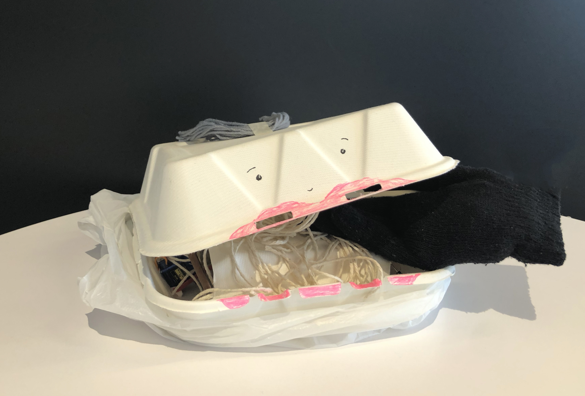
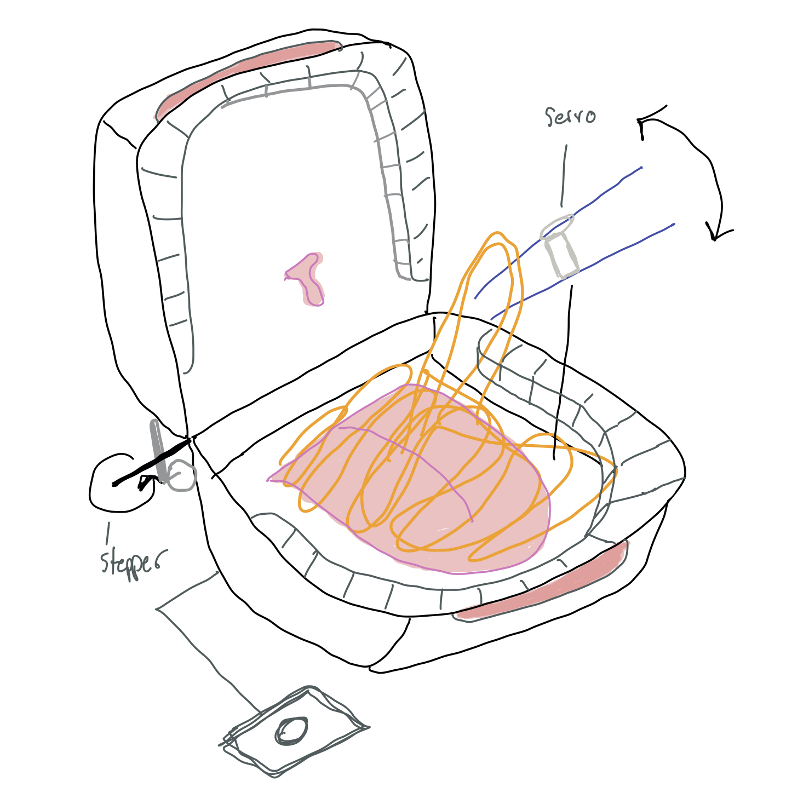

# COMS 3930: Creative Embedded Systems
## Module 4 – Kinetic Sculpture   Spencer Bruce 

### Included Files

I have uploaded the following to the GitHub repo:
- this README 
- a takout.ino program to be run on an ESP32 microcontroller. This is what  controls the motor movements + connects to the server.

A video of Takout Munch in action can be seen [here](https://youtu.be/HAtsPK7U760). 

### Creative Vision
I went through many design iterations in the creation of this project. I had originally attempted to use a Raspberry Pi and the ESP32 along with multiple servos, however this proved to be too complex for the materials and time I had access to during the gl*\*bal p**demic. 

Then, the dining hall accidentally gave me an extra takeout container. I did not want it to go to waste, so I sketched out a silly idea of a hungry takeout container. I ended up liking the idea of it and got to work. 

Once I had my sketch, I started to set up my motors so that they worked independently my referring to both our kit's code and the servo + stepper code from class. Then, I combined the code into a program that would modify both motors at once. I only needed to use the ESP-32, but added an external battery pack to provide power to the entire sytem. Once I had this set up, I got to work on assembling the sculpture.

Firstly, I tried a few different stepper motor placements to try to find a position where the motor could prop open/allow closed the lid of the container. I eventually found that a placement of the motor in the back corner of the box, situated with a chopstick, could lift up the lid of the box pretty quickly. The motor was quite an eyesore when placed inside the box, so I decided to sew it onto the outside of the box and use a binder clip to extend the drive shaft into the box. Later, all I needed to do was cover the ugly bits with a plastic bag during installation. 

The hardest part of the assembly was stuffing and sewing the glove/hand to be shaped like a hand holding chopsticks. I stuffed the glove with some paper napkins and used some sewing thread to hold fingers in position and attach the chopsticks. Originally, I wanted to move the entire hand with the servo motor, but the servo provided in our kit provded to be much too weak for that. 

I landed upon the idea to tie a piece of thread connecting the servo with the upper chopstick, so that when the servo rotated, it tugged on the chopstick and closed it shut. I later replaced the thread with a piece of yarn noodle to better hide what was actually happening. 

After adding some lips, eyes, and hair, all I needed to do was to wrap my code in [the skeleton](https://github.com/mbennett12/kinetic-sculpture-webapi) provided by Max + Ahmed. I added a slight movement when an internet connection was successful to allow me to debug my sculpture if needed.

After some fine-tuning and testing, I was able to successfully install my sculpture in Milstein 5 with some other students in class :) It was great to see what everyone made! 

### Dependencies
I used the following items to create this project: 
- 1 x ESP-32 microcontroller
- 1 x takeout container
- 1 x servo motor
- 1 x stepper motor 
- 1 x winter glove 
- 3 x chopsticks
- 1 x binder clip 
- 1 x plastic bag (to be reused!)
- yarn 
- stuffing for glove
- a needle + thread
- 1 x micro-USB cable for flashing the ESP32
- some wires
- tape
- scissors
- pens/markers to decorate